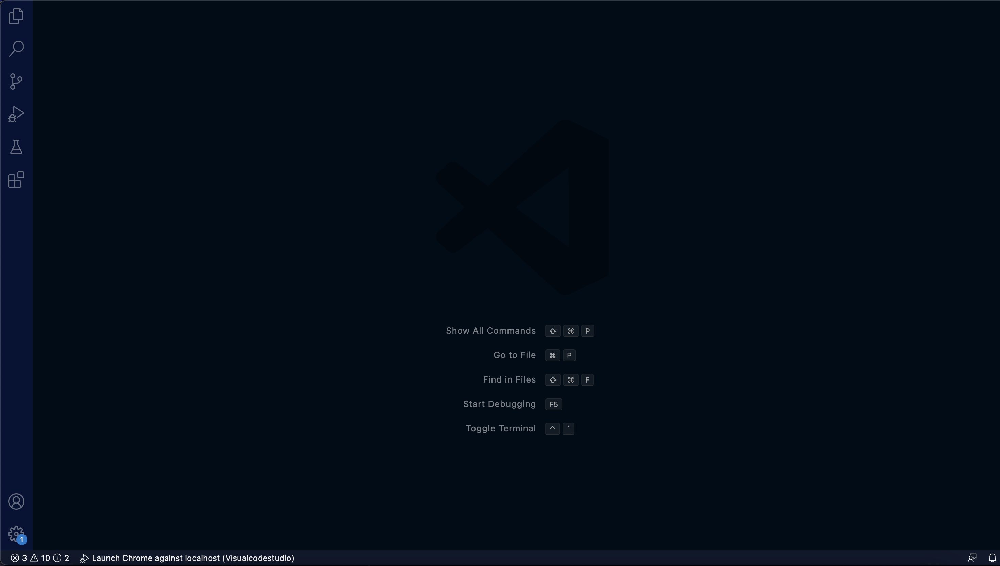

# CSE 15L Lab Report 1


__How to Install VS Code__ 

- First you want to Google VS Code ([visualstudio.com](https://code.visualstudio.com/))
- Second you want to click on the download button that is on the top right in blue. 
- Once clicked, download the correct version depending on your operating system. 
- Once downloaded, open VS Code and enjoy! 

>_(Your terminal should look something similar to this)_




__How to Remote Connect your computer__

- First you want to open a Terminal in VScode. This can be accoplished by looking at the bar on the top of your screen 
and clicking terminal then click new terminal. 

- In your terminal, you want to type in ```$ ssh cs15lwi23XX@ieng6.ucsd.edu``` with XX being replaced with your own account number.

 > $ is used to write commands and should not be included when you write the command in to the terminal. 

- Once typed, you should be prompted this message in your terminal. 

```
   The authenticity of host 'ieng6.ucsd.edu (128.54.70.227)' can't be established.
   RSA key fingerprint is SHA256:ksruYwhnYH+sySHnHAtLUHngrPEyZTDl/1x99wUQcec.Are you 
   sure you want to continue connecting (yes/no/[fingerprint])?
```
> You want to type yes, allowing you to remote connect and conutinue on. 

- After typing yes, you will be prompted to enter your password. This password being your Student SSO password. 

> _If you want to resert your password ([course-specific account lookup](https://sdacs.ucsd.edu/~icc/index.php)) this link will help you do so._

- When the password is entered correctly, your terminal will output

 ```
 # Now on remote server
 Last login: Sun Jan  2 14:03:05 2022 from 107-217-10-235.lightspeed.sndgca.sbcglobal.net
 quota: No filesystem specified.
 Hello cs15lwi23zz, you are currently logged into ieng6-203.ucsd.edu

 You are using 0% CPU on this system

 Cluster Status 
 Hostname     Time    #Users  Load  Averages  
 ieng6-201   23:25:01   0  0.08,  0.17,  0.11
 ieng6-202   23:25:01   1  0.09,  0.15,  0.11
 ieng6-203   23:25:01   1  0.08,  0.15,  0.11

 Sun Jan 02, 2022 11:28pm - Prepping cs15lwi23

 ```

> NOTE: The time and date and other things in this message are not going to be exact to you and will very per person and operating system.
 
- Now you have successfully done remote connecting!

> What a successful remote connect looks like:


__Trying Commands Now That You Have Successfully Connected Remotely__

>___Here are some commands that you can try:___

`cd - Change directory allowing the user to go inside of a different working directory`

`ls - list allows the user to see all of the working directory in that location` 

`pwd - print working directory allows the user to see the path of that directory`

`mkdir - make a directory allows the user to create a directory`

`cp - copy allows the user to copy a file or directory`

`ls -a - list the content of a directory for the user (even the hidden files)`

- Enter some commands listed above and try to figure out what they do. 

> Your terminal should look similar to this when running the commands: _pwd_, _cd_, _ls_, _-lat_, and _ls -a_.


- These commands are very useful in opening the contents of a file and navigating through the remote computer.


