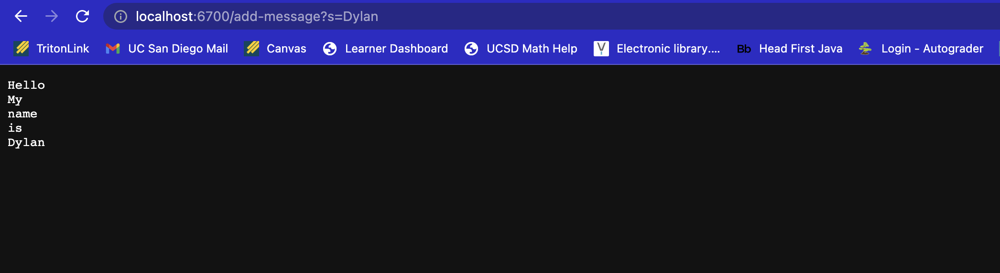
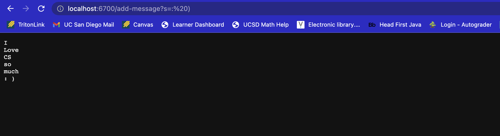
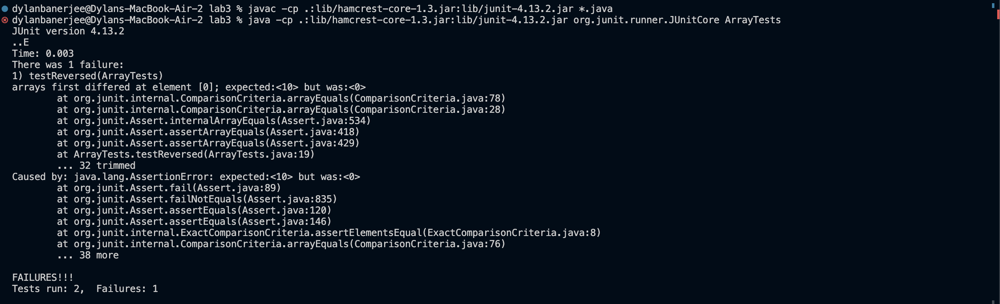

# CSE 15L Lab Report 2

> ***StringServer code:***
 
<pre><code>import java.io.IOException; 
import java.net.URI; 
import java.util.ArrayList;

class Handler implements URLHandler {

    StringBuilder searchString = new StringBuilder();

    public String handleRequest(URI url) {

        if(url.getPath().contains("/add-message")){

        String[] temp = url.getQuery().split("=");

        if(temp[0].equals("s")){

        searchString.append(temp[1]);
        searchString.append("\n");

        }

        return searchString.toString();
        }
            return "404 Not Found!";
        }
    }

class StringServer {
    public static void main(String[] args) throws IOException {
        if(args.length == 0){
            System.out.println("Missing port number! Try any number between 1024 to 49151");
            return;
        }

        int port = Integer.parseInt(args[0]);

        newServer.start(port, new Handler());
    }
} </code></pre>

> ***Working example:***

- Method used: 
  - handleRequest: This method is used to look for the give url from the localhost
  - newServer: This method creates a new local server using the inputted port number 
- Valid arguments:
  - handelRequest: The use of string as an argument is valid for this method 
  - newServer: The use of intergers as an arguemtn is valid for this method 
- Change values: 
  - handelRequest: The value changed by parsing a "\n" to the input 
  - newServer: The value isn't changed and the int is used for the port numnber

 
- Method used: 
  - handleRequest: This method is used to look for the give url from the localhost
  - newServer: This method creates a new local server using the inputted port number 
- Valid arguments:
  - handelRequest: The use of string and characters as an argument is valid for this method 
  - newServer: The use of intergers as an arguemtn is valid for this method 
- Change values: 
  - handelRequest: The value changed by parsing a `"\n"` to the input 
  - newServer: The value isn't changed and the int is used for the port numnber

> ***Bugs in code:***

__Note__: Input that causea symptoms &darr;

<pre><code>import static org.junit.Assert.*;

import org.junit.*;

public class ArrayTests {
	@Test 
	public void testReverseInPlace() {

    int[] input2 = {1,2,3,4};
    ArrayExamples.reverseInPlace(input2);
    assertArrayEquals(new int[]{4,3,2,1}, input2);
    

	}

  @Test
  public void testReversed() {

    int[] input2 = {1,2,3,4,5,6,7,8,9,10};
    assertArrayEquals(new int[]{10,9,8,7,6,5,4,3,2,1}, ArrayExamples.reversed(input2));
    assertNotEquals(input2,ArrayExamples.reversed(input2));

  }

@Test 
public void testAverageWithoutLowest(){

double[] input1 = {5,2,10,2,2};
assertEquals(7.5, ArrayExamples.averageWithoutLowest(input1), 0.000001);

}

}</code></pre>

__Note__: Input that doesn't cause symptoms &darr;

<pre><code>import static org.junit.Assert.*;

import org.junit.*;

public class ArrayTests {
	@Test 
	public void testReverseInPlace() {
    int[] input1 = { 3 };
    ArrayExamples.reverseInPlace(input1);
    assertArrayEquals(new int[]{ 3 }, input1);

	}

  @Test
  public void testReversed() {
    int[] input1 = { };
    assertArrayEquals(new int[]{ }, ArrayExamples.reversed(input1));

  }

@Test 
public void testAverageWithoutLowest(){

double[] input1 = {5,10,2};
assertEquals(7.5, ArrayExamples.averageWithoutLowest(input1), 0.000001);

}

}</code></pre>

__Note__: Symptoms from code

- The symptom was caused from the method `testerReversed()` not properly reversing the array

__Note__: Code before and after 

- Before (with bugs): 
  
<pre><code> public class ArrayExamples {   			

  // Changes the input array to be in reversed order
  static void reverseInPlace(int[] arr) {
    for(int i = 0; i < arr.length; i += 1) {
      arr[i] = arr[arr.length - i - 1];
    }
  }

  // Returns a *new* array with all the elements of the input array in reversed
  // order
  static int[] reversed(int[] arr) {
    int[] newArray = new int[arr.length];
    for(int i = 0; i < arr.length; i += 1) {
      arr[i] = newArray[arr.length - i - 1];
    }
    return arr;
  }

  // Averages the numbers in the array (takes the mean), but leaves out the
  // lowest number when calculating. Returns 0 if there are no elements or just
  // 1 element in the array
  static double averageWithoutLowest(double[] arr) {
    if(arr.length < 2) { return 0.0; }
    double lowest = arr[0];
    for(double num: arr) {
      if(num < lowest) { lowest = num; }
    }
    double sum = 0;
    for(double num: arr) {
      if(num != lowest) { sum += num; }
    }
    return sum / (arr.length - 1);
  }
}</code></pre>

- After (bugs fixed):
<pre><code>public class ArrayExamples {

  // Changes the input array to be in reversed order
  static void reverseInPlace(int[] arr) {

    int[] holder = arr.clone();

    for(int i = 0; i < arr.length; i += 1) {

     arr[i] = holder[arr.length - i - 1];

    }
  
  }
  // Returns a *new* array with all the elements of the input array in reversed
  // order
  static int[] reversed(int[] arr) {
    int[] newArray = new int[arr.length];
    for(int i = 0; i < arr.length; i += 1) {
      newArray[i] = arr[arr.length - i - 1];
    }
    return newArray;
  }

  // Averages the numbers in the array (takes the mean), but leaves out the
  // lowest number when calculating. Returns 0 if there are no elements or just
  // 1 element in the array
  static double averageWithoutLowest(double[] arr) {
    int count = 0;
    if(arr.length < 2) { return 0.0; }
    double lowest = arr[0];
    for(double num: arr) {
      if(num < lowest) { lowest = num; }
    }
    double sum = 0;
    for(double num: arr) {
      if(num != lowest) { sum += num; }
      else{count++;}
    }
    return sum / (arr.length - count);
  }
}</code></pre>

>__Note__: This code fixes the issues in the methods `reverseInPlace()`, `reversed()`, and `averageWithoutLowest()` with both reversed methods needing there contents reassined into a holder array allowing for the elements to be properly reversed. The only difference is in `reversed()` the array that needed to be returnd was fixed to return a new array object. The issue with `averageWithoutLowest()` was in the instance of the lowest number being listed more than once inside of the double array. In the original code, the sum was divided by one (accounting for one instance of the lowest number) but the adjusted code above accounts for the lowest number being listed more than one by increasing a counter each time the lowest number is iniside of the double array, and taking that counter value and subtracting it by the array's length.

***Take away from labs:***

In the lab from week 2, I learned how a url address works with the use of paths and querey. I also learned how the url address allows for certain functions to be achieved. This allowed me to display messages on the local server that was created above. In week 3, I learned about debugging tips and how to create good tester methods that will allow me to test methods efficently and multiple methods and variables at once.
 

