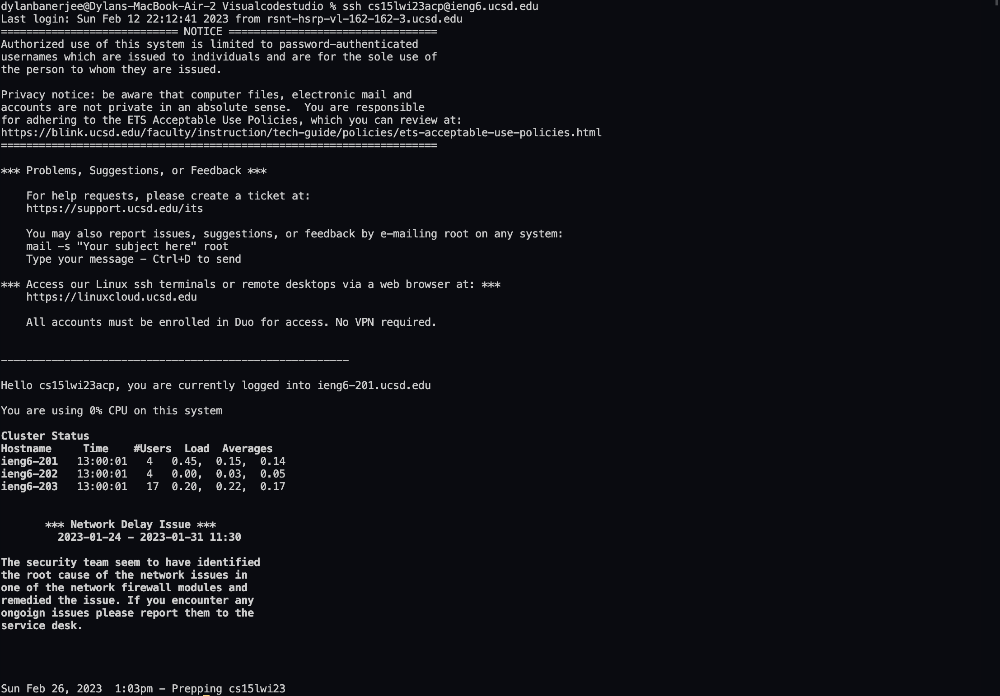

# CSE 15L Lab Report 4

***Steps taken for time improvment -***

**Step 1:**

- When logging into my ssh account, I simply copied and pasted the command with my specific login.

>__Note__:When logging into my account, it does not propmt me to type my password, due to the fact that my personal 
machine's ssh key has been saved into the remote server under my account.

